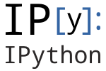

footer: Write the Docs PDX 2016
slidenumbers: true
build-lists: true

# [fit] Code the Docs

# [fit] Interactive Documentation

---

 

 

^ Hi, we're Tim and _Paris_, and we're here to talk about code-based documentation.

---

### We Speak Australian
^ Please tell us if we say something you don't understand

---

^ We think a lot about documentation, as one of the main things we do is write documentation, often in the form of books.

---

### People Get Lost

^ People mess up where they are when moving between the code and the books

---

> I find the documentation and my own notes living alongside the code to be incredibly handy. It means I don't get lost learning this language and the APIs.

-- written feedback from our last Swift training, Melbourne, May 2016

---

## Interactive document environments?

- Swift Playgrounds

- IPython Notebooks

- Project Jupyter

- ...and a few others

---

---
## Swift 

- Introduced 2 years ago by Apple
- Currently at version 2.2
- Made open source in December 2015[^1]
- Apache License 2.0
- Currently supports OS X and Linux
- Windows support on the way

[^1]: For more information on the Swift project, check out their website: http://swift.org/

---

## Swift Playgrounds

- an interactive Swift coding environment
- each statement is evaluated and displayed
- designed for prototyping, experimentation, and learning
- can be paginated
- supports Markdown  

---

IPython has a terrible tiny logo

---

## IPython Notebooks

- Interactive Python coding environment
- works pretty much the same as Swift Playgrounds
- designed for academic and scientific documentation
- Supports text, equations, and graphs

---

---

## Project Jupyter

- Successor to IPython
- Started in 2014
- Supports multiple languages
- Otherwise the same as IPython Notebooks

---

## Swift Playgrounds

^ Let's take a more detailed look at Swift playgrounds, our favourite example of this sort of thing!

---

^ This is a quick run-through of 

---

## Markup in Playgrounds

---

## Project Jupyter Notebook

put a movie in of this!

---

## Project Jupyter in the Browser

get a movie of http://www.oreilly.com/oriole/

---

## Strengths

- Code and Docs __literally__ together
- Can change things on the fly
- Mixed Media

---

## Weaknesses 

- Kinda crashy
- Limited language/framework support
- Doesn't hook into docs tools
- Only really works for narratives

---

## What's next?

- Boffin's will fix the tech
- Be easier to add in new languages & projects
- This will replace/become books & articles
- Better support for non-narrative documentation
- More integration with video and screensharing

---

## Thanks!

- Questions?
- Find us on Twitter @the_mcjones and @parisba
- Slides and notes available at:
https://github.com/parisba/presentations

