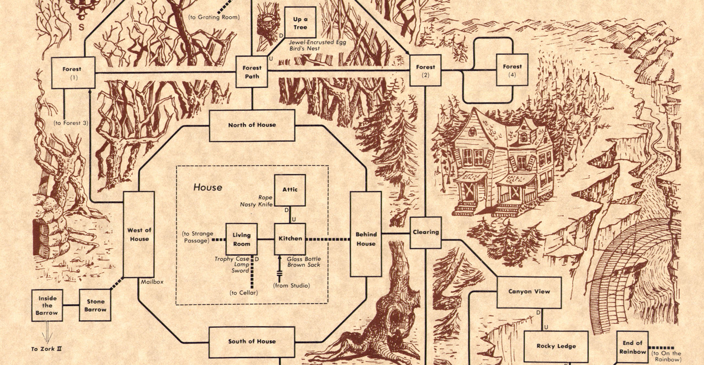
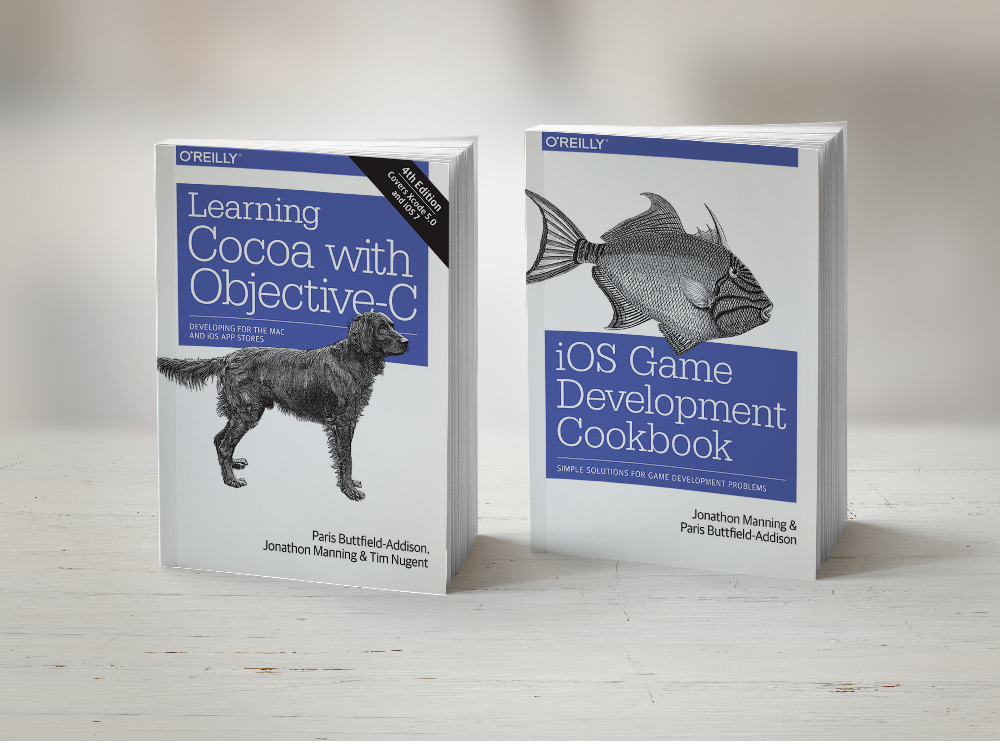

footer: Write the Docs PDX 2016
slidenumbers: true
build-lists: true
theme: Merriweather

# [fit] Code the Docs

# [fit] Interactive Documentation

---

^ PARIS: Hi! We're here to talk about Interactive Code-based Documentation

---

## Tim (unicorn)
##  Paris (not unicorn)
### @parisba and @the_mcjones

^ TIM: I'm Tim

^ PARIS: And I'm Paris, you can find us on Twitter if you want!

---

### [fit] We Speak Australian
^ PARIS: We speak Australia. 

^ TIM: Please tell us if we say something you don't understand! 

^ PARIS: We're really excited to be speaking here, and we're thoroughly enjoying this conference so far.

^ TIM: Thanks to everyone who makes it happen. *Tim does his bingo joke*

---

^ PARIS: We think a lot about documentation, as one of the main things we do is write documentation, often in the form of books.

---

^ TIM: We write a lot of books.

---

^ PARIS: ... a lot of books.

^ TIM: And this all started because we wanted a closer linkage between our books and the provided code.

---

### [fit] The Situation

^ TIM: We also present a lot of programmer training workshops, particularly teaching rapidly changing technologies such as game development, and Apple's developer environment –– Swift, previously Objective-C, and APIs like Cocoa and CocoaTouch for Mac and iPhone development.

---

### [fit] Code + Docs + Notes?!

^ PARIS: In the last 2 years of teaching these classes, particularly with Swift, Apple's new language, we've noticed that those in the class trying to learn the language have particularly enjoyed one component of the way Apple's frameworks and languages work: Swift Playgrounds.

^ We think a lot about documentation, as one of the main things we do is write documentation, often in the form of books.

^ all started because we wanted a closer linkage between our books and the provided code

---

### [fit] People Get Lost

^ TIM: People mess up where they are when moving between the code and documentation.

---

> I find the documentation and my own notes living alongside the code to be incredibly handy. It means I don't get lost learning this language and APIs.
-- feedback Swift training in Melbourne, May 2016

^ PARIS: This is a quote from one of our past training participants.

^ TIM: People have a disconnect between what they see and what they do.

---

### [fit] Code + Docs + Notes!

^ TIM: The more we explored these Interactive Environments –– today we're calling them Interactive Documentation Environments –– the more we thought they were particularly amazing for certain types of technical educational material, teaching, and distributing some types of documentation.

---

## Interactive document environments?

- Swift Playgrounds

- IPython Notebooks

- ... which are now Jupyter Notebooks

- ...and a few others

^ PARIS: There's a bunch of different interactive programming environments like this, including Swift Playgrounds, IPython Notebooks, which are now known as Jupyter Notebooks, and a few others.

---

^ TIM: We haven't really got time to go through all of these in detail, so we're going to focus the most on the one we have the most experience with.

^ PARIS: Playgrounds, which are part of Apple's Swift.

---
## Swift 

- Introduced 2 years ago by Apple
- Currently at version 2.2
- Made open source in December 2015[^1]
- Apache License 2.0
- Currently supports OS X and Linux
- Windows support on the way

[^1]: For more information on the Swift project, check out their website: http://swift.org/

^ PARIS: Swift is Apple's new language. And is open source under the Apache License.

^ TIM: Playgrounds, which we're talking about here, are not open source ... yet. 

^ PARIS: But the Swift REPL, which is the bulk of Playgrounds, is open source.

^ TIM: everything you see in Playgrounds with us today is part of Apple's Xcode, which is free for Macs.

^ TIM: We're a bit biased, but we think Swift is the bees knees!

---

## Swift Playgrounds

- an interactive Swift coding environment
- each statement is evaluated and displayed
- designed for prototyping, experimentation, and learning
- can be paginated
- supports Markdown (yay?!) and HTML

---

## Markup in Playgrounds

^ PARIS: Comment on Erik's opinions on markdown.

^ TIM: these are still new. And we think it will get support for more later, apple already uses Sphinx..

---

## IPython Notebooks

- Interactive Python coding environment
- works pretty much the same as Swift Playgrounds
- designed for academic and scientific documentation
- Supports text, equations, and graphs

^ PARIS: been around for a while

^ TIM: rarely used to teach

---

---

## Project Jupyter

- Successor to IPython
- Started in 2014
- Supports multiple languages
- Otherwise the same as IPython Notebooks

^ TIM: successor to IPYthon... <talk about them>
	
---

## Demo-Gods I Summon Thee!

^ Paris: time to be gutsy

^ TIM: that's pjf, a super nice guy 

---

## Swift Playgrounds

^ Let's take a more detailed look at Swift playgrounds, our favourite example of this sort of thing!

^ we think this basically because they are more or less designed for it

---

## Live Demo!

^ DEMO: Creating new documentation for something (maths)

^ put a bird on it

---

## [fit] Live Demo!

^ DEMO: Newton's Cradle

^ shows off that they are super powerful

---

^ This is a quick run-through of 

---

## [fit] Project Jupyter

---

## [fit] Live Demo!

^ our favourite example is ORMs regex golf video

---

^ DEMO: This is a quick run through of a live browser training course talking about regex

^ http://www.oreilly.com/oriole/

^ Its based on an XKCD comic

^ so we go through running each miniscript

^ we can run the regex to see it fails

^ meh who cares about fremont

^ lets see if it works if we add trump in!

---

### [fit] Strengths

^ PARIS: So, what's the point of all this?

---

## Strengths

- Code and Docs __literally__ together
- ... also notes by the person reading the docs	
- Can change things on the fly
- Mixed Media

^ in theory we've had all this for a while but people have only really started using it

---

# [fit] You can mix notes, live code, and docs

^ this was sort of a suprise to us
^ but we've found people REALLY like being able to do this

---

> I find the documentation and my own notes living alongside the code to be incredibly handy. It means I don't get lost learning this language and APIs.
-- feedback Swift training in Melbourne, May 2016

^ PARIS: we are pretty aggressive about asking for feedback, it mostly works

---

### [fit] Weaknesses

---

## Weaknesses 

- Kinda crashy...
- Limited language/framework support
- Doesn't hook into docs tools
- Only really works for narratives
- Not every language/platform/thing

^ for example playgrounds only support markdown

---

## What's next?

- Boffins will fix the tech
- Be easier to add in new languages & projects
- This will replace/become books & articles
- Better support for non-narrative documentation
- More integration with video and screensharing

---

## Where to learn more...

- On a Mac? Download Xcode from the App Store
    - Then play in Playgrounds.
- On something else? Download Jupyter Notebook
	- The process is complex
	- The docs for this are bad...

^ best way to learn is to mess around with it

---

---

## Thanks!

- Questions? Find us up the front..
- .. or find us on Twitter!
    - @the_mcjones (horse)
	- @parisba (not horse)
- Slides and notes will be online at: http://lonely.coffee and http://blog.paris.id.au

